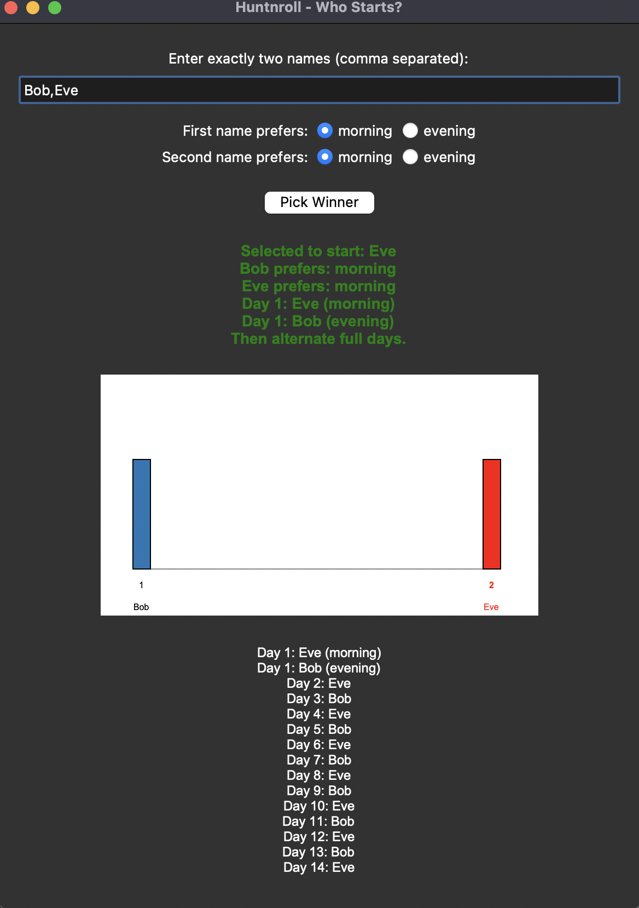

# Huntnroll

> Decide who starts — fairly and visually!

## Overview

Huntnroll is a simple Python app to help groups decide who gets to start (e.g., who gets the first day in the hunting season, or any other turn-based activity). It provides both a command-line interface (CLI) and a graphical user interface (GUI) for easy use.

- **Uniform random selection:** Every participant has an equal chance of being chosen.
- **Visual feedback:** The GUI shows a clear, graphical representation of the selection process.
- **Easy to use:** Enter names, click a button, and see the result!

---

## Features

- **CLI mode:** Run from the terminal to select a starter from a list of names.
- **GUI mode:** Enter names in a window, see a visual distribution, and get instant results.
- **Fairness:** Uses a uniform distribution so every name is equally likely to be picked.
- **Statistics:** See the selected index, percentile, and a visual bar chart of the distribution.

---

## Installation

1. **Clone the repository:**
   ```sh
   git clone https://github.com/khintz/huntnroll.git
   cd huntnroll
   ```
2. **(Optional) Create a virtual environment:**
   ```sh
   python3 -m venv venv
   source venv/bin/activate
   ```
3. **Install requirements:**
   - No external dependencies are required for the basic app (uses only Python standard library).

---

## Usage

### Command-Line Interface (CLI)

Run the app from the terminal:

```sh
python -m huntnroll name1 name2 name3
```

Or, run without arguments and enter names when prompted:

```sh
python -m huntnroll
```

### Graphical User Interface (GUI)

Run the GUI for a visual experience:

```sh
python huntnroll/gui.py
```

- Enter names (comma separated) in the input field.
- Click **Pick Winner**.
- See the selected name, index, and a bar chart showing all names with the winner highlighted.

---

## Example



---

## Project Structure

```
huntnroll/
    README.md
    huntnroll/
        __main__.py   # CLI entry point
        gui.py        # GUI application
```

---

## License

MIT License. See [LICENSE](LICENSE) for details.

---

## Contributing

Pull requests and suggestions are welcome!

---

Enjoy fair and fun turn selection with Huntnroll!
